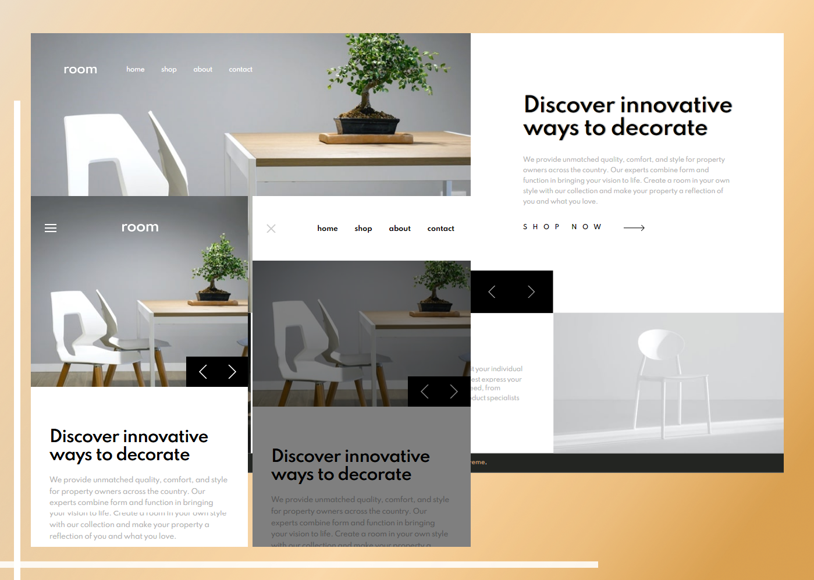

# Frontend Mentor - Easybank landing page solution

This is a solution to the [Room homepage challenge on Frontend Mentor](https://www.frontendmentor.io/challenges/room-homepage-BtdBY_ENq). Frontend Mentor challenges help you improve your coding skills by building realistic projects.

## Table of contents

1. The Challenge
1. Screenshot of My Work
1. My Process
1. Author
1. Acknowledgements

## Overview

### The challenge

Users should be able to:

- View the optimal layout for the site depending on their device's screen size
- See hover states for all interactive elements on the page
- Navigate the slider using either their mouse/trackpad or keyboard

### Screenshot

### Links

- Solution URL: [Go to frontendmentor.io](https://www.frontendmentor.io/solutions/room-homepage-using-grid-and-flexbox-UoJQphNfJ)
- Live Site URL: [View live site](https://rouwe.github.io/fem_room_homepage/)

## My process

I started by diving the page into smaller sections and tackling each one at a time. Starting at the top to bottom while adding some functionality using vanilla JavaScript when an interaction is required. I also used a combination of CSS Grid and Flexbox for laying out things.

### Built with

- Semantic HTML5 markup
- CSS custom properties
- JS
- Flexbox
- CSS Grid
- Mobile-first workflow

### What I learned

This allows me to improve my layout and grid manipulation skills. It also helps me solidify the fundamentals of javascript DOM manipulation. I also added a feature that keeps track of viewport and changes the image source used on slider for mobile or desktop.

### Continued development

I will be focusing more on fundamentals of creating a website.

## Author

- Frontend Mentor - [Rouwe](https://www.frontendmentor.io/profile/rouwe)

## Acknowledgments

I'm thankful for Frontend Mentor's challenges. Since this will allow me to hone my skills further.
